# Paper Dreams

This is a website for a fiction company called, "Paper Dreams," Code Institute Portfolio Project 5. The artwork presented on the site has been created by Leah Janss Lafond and Vivi Janss, with all rights reserved.

## Table of Contents

### Marketing Strategy
The site owner is not interested in joining Etsy as she feels the platform is too crowded, and there is some suggestion it has declined. [TechPenny blames Etsy's algorithms](https://techpenny.com/typical-etsy-demographics-stats/) and the amount of time customers must spend on the platform only to get frustrated and leave after they don't find what they are looking form. By contrast, [Statista.com](https://www.statista.com/statistics/409375/etsy-active-buyers/) reported an 18% increase in sales. Reuter's reports Etsy has suffered related to [SVBs collapse with resulting delays processing sellers' payments](https://www.reuters.com/markets/etsy-other-e-commerce-companies-feel-squeeze-svb-collapse-2023-03-13/), with some sellers complaining Etsy lacked transparency. Notwithstanding these reports on the Etsy platform itself, there is a clear interest by consumers in handcrafted items created by small businesses. 

#### Understanding the audience

Paper Dreams' audience is matches the Etsy Community whose audience is described as largely females between the ages of 18-35. Etsy estimates 86% of their buyers are female. Like Etsy, the site owner expects the audience to be young, female and interested in unique, original items with vibrant colour palettes. [Etsy describes the buyer's behaviour and trends](https://www.etsy.com/seller-handbook/article/marketplace-insights-emerging-etsy-buyer/811544572163) of which the following apply to Paper Dreams:

1. They want to support small businesses. They use the hashtag #StandWithSmall. The site could also make use of this hashtag. [Statusbrew](https://statusbrew.com/insights/small-business-hashtags/) lists some top trending small business hashtags.  [Top-Hashtags](https://top-hashtags.com/hashtag/smallbusiness/) offers  some useful ideas, moving away from the specific art scene to other interest areas of potential customers, such as #womanownedbusiness, #newbusiness, #supportsmallshops, #handcraftedgifts, #handmadecrafts, and  #handcrafted"add item". 

2. They want to make their homes more stylish with unique bright items. 

3. The are interested in projects they can do from home. (Relates to tutorials/learn page)

4. The are looking for unique gifts for various occasions. 

For the purpose of this marketing strategy, we want to think about our customer in narrow terms in order to be able to create useful keywords for the site and and overall marketing strategy. 

    - Age: broadly 20-35
    - Gender: identifying as female
    - Online hangouts: 
        - Most likely Instagram users
        - Likey to check accounts through the day, but most likely present in the evenings
    - Interests: 
        - Social responsibility
        - Sustainability
        - Enjoys browsing and shopping online
        - Listens to podcasts related to fashion, exercise, entrepreneurship, freelancing, cookery, health, lifestyle, goal-setting, mindfulness, and general well being
        - Reads blogs
        - Spending power
            - Likely to rent 
            - Decent income, but need to save and pay back loans
            - Likely to have a social life (no kids yet)
            - Up and coming in their careers, but will suffer if they become mothers.
        - Frustrations
            - Getting on the housing ladder
            - Progressing in career
            - Burnout at  work/instability in careers.
            - Lack of childcare options, if mothers

#### Marketing Goals
#### Brand
#### Valuable Content
#### Social Media
#### Email Marketing
#### SEO & Analytic

USE WORDTRACKER.COM FREE TRIAL!!!!!!!!!!!!!

1. Keyword Search

    - General for site
        - Short-tail: sustainable crafts, handmade  masks, handcrafted gifts, handmade gifts, unique interiors, unique decorations, affordable art
        - Long-tail: unique sustainable gifts, handmade by Surrey artist, fun decorations to brighten the home, gifts to lift your spirits, one-of-a-kind affordable artworks
    - Papier mache masks:
        - Short-tail keywords: papier mache masks, masks for sale, handcrafted masks, 
        - Long-tail keywords: handcrafted papier mache masks, unique papier mache masks, papier mache masks for Halloween
    - Papier mache figures and animals:
        - Short-tail keywords: whimsical art, quirky art, decorative animals, colorful art, 3d art, wacky figurines, unique sculptures
        - Long-tail keywords: handcrafted papier mache animals, handmade children's room decor, fun decorations for children's rooms, one-of-a-kind sculptures
    - Pen & ink prints:
        - Short-tail keywords: pen and ink prints, prints for sale
        - Long-tail keywords: black and white pen and ink prints, pen and ink abstract prints, pen and ink art prints, abstract art therapy
    - Paintings:
        - Short-tail keywords: paintings for sale, art paintings
        - Long-tail keywords: watercolour paintings for sale, abstract mixed media paintings for sale, modern art paintings
    - Tutorials:
        - Short-tails keywords: mask tutorial, papier mache tutorial
        - Long-tail keywords: how to make a bespoke mask, mould-making tips for mask-making, choosing the right paper for your papier mache project, inexpensive art projects to do at home, cheap things to do with kids, cool projects to make with paper and glue

2. On page optimization

    **Home page**
    - Page titles
    - Meta descriptions
    - Headers
    - Content

    If this were a genuine business, it would make sense for the artist to use her name as the domain name and then change the site title to Paper Dreams by "Artist Name".

    
    **Products page**
    - Page titles
    - Meta descriptions
    - Headers
    - Content

    **Events page**
    - Page titles
    - Meta descriptions
    - Headers
    - Content
    
    **Learn page**
    - Page titles
    - Meta descriptions
    - Headers
    - Content
    
    **Learn page**
    - Page titles
    - Meta descriptions
    - Headers
    - Content

3. Off-page optimization

    If this  were a real site, the business should seek to engage with other artists and website owners by writing guest blogs, or by asking them to link to this site for its resources (the tutorials blog), events or by reviewing our site and art works. An obvious place to start would be papiermache.co.uk which is a platfrom for papier mache artists. By posting there regularly, you quickly become part of a community and if you post projects there, your project will be the first or one of the first visitors to the site will see. Many of these artists have their own websites and community connections and are generous with help and advice.

4. Technical optimization

    - Page loads fast
    - Mobile friendly
    - Easy to navigate

5. Content

    - Text is highly relevant to page purpose. No superflous text.
    - Non commercial content aims to retain visitors/create repeat visitors

6. Google Analytics 

####

## Website Design
### The Strategy Plane
The goals of the site are similar to that of Etsy and NotOnTheHighStreet. This site aims to offer users unique items to bring a bit of joy into their lives.  The site owner does not wish to have a profile on these sites, because they wish to display works not for sale as well as to provide tutorials. While the site will be online, and can be thought of as having a global reach, the site owner is also very much involved in the community, and wishes to have an exclusive site.

#### Site-Owner Goals
This is a website for an artist to sell their artwork under the name "Paper Dreams". The overall goals of the website are to:

1. Present the artist's work in an attractive way.
2. Give visibility to other artists who's work will be shown on the events page of the website. 
3. Inspire people to create and share their own works of art.
4. Gain insight on which products customers like.
5. Increase sales potential with online presence.
6. To track customer sales to make tax reporting easier.
7. To engage with customers and the artistic community via a tutorials page and the site's links to her Facebook page.
8. To offer exclusive opportunities to registered users, such as free tickets to exhibitions.

### Site Visitor Goals
1. To discover unique artwork that can not be found in shops.
2. To be able to see clearly what is available for sale.
3. To be able to make a purchase quickly and easily.
4. To have visible, clear information about shipping and returns polciies.
5. To make and leave reviews.
6. To be able to easily contact the shop with questions.
7. To add/delete items from a wishlist.
8. For some, to learn how to make their own artworks
9. To understand how my personal information will be used. 
 

### Emotional Factors
It is the artist's hope that her artworks will help site visitors reimagine their surroundings. The site should be easy and intutive to navigate so as not to detract from the works themselves. An attractive website will add to the value of the work as the same care as creating the art will go into the presentation of it via the website. Even if the customer is not ready to buy, it is the hope of the site owner that the customer will like the experience of the site so much that they will return repeatedly to look and browse.  

The reviews page is also meant to be something of a community page where customers can leave their thoughts about their purchases and also upload photos to show how they are displaying the product at home or in their workplace. The idea is that it will inspire prospective customers, and encourage conversation. 

### User Stories

CAN I LINK TO MY BOARD ON GITHUB?

## The Scope Plane

Considering the goals above, the following requirements were identified.

### "Must have" - Minimum Requirements
- A homepage which gives an overview of the purpose of the site, a clear call to action (shop button) and information about who is behind it.
- An intuitive navigation bar and a footer that leads customers to all the information they need to get in touch, review shipping and returns policies and browse products.
- A cleanly presented products page with an image, title and price for each item.
- A product detail page, with customization where appropriate (e.g. print size)
- Customers should receive success/confirmation messages when adding products and throughout the checkout process.
- A checkout page that can be used without registration.
- A checkout page that can be used as a signed in user. 
- A checkout page that allows the customer to save their shipping details to their profile.
- A checkout process with Stripe that is safe for customers.
- After payment there should be success messages on screen.
- After payment, the customer should receive a confirmation email, including an order number and the products ordered. 
- A registered customer must be able to access their order history.
- A contact page that allows customer to submit questions via a form. 
- An events page that allows the ower to use a form to enter information about upcoming events such as an exhibition or a course.
- A learn page for the artist to be able to present tutorials as a blog, with images.
- Site users should be able to comment on tutorials/blog entries and upload photos of their work. 
- Site users should be able to filter tutorials by title or theme (e.g. There might be more than one mask-making tutorial)

### "Should have" - Intended Requirements
- The ability to add items to a wish list. 
- The to keep a tally of the number of times an item was added to someone's wishlist.
- Customers should be able to leave a review, including photos. If there is not enough time, customers could be encouraged to do this on Facebook.
- It should be possible to search for reviews by item title.
- The reviews should be imported into the products page. For example, if an item has received reviews, there should be a link the reviews page, set that item's id. 

### Contraints
The major constrainst is the timeline for completing the project. 

## The Structure Plane
### Planning
As this is an e-commerce site, the major objective is to sell artworks. The customer journey from the perspective of making a purchase is described below. The elements of the site related to exhibitions and tutorials have the objective of building advocacy for the company, enabling it to build a following and retain customer interest beyond the intitial point of sale.  

#### The Customer Journey

- **Discovery/Awareness:**  The customer is likely to hear about or find the website via word of mouth, search engines or social media. The site owner will not be buying advertising space.
    - User Action - asks a friend if they know any sites, uses keyword searches to find sites.
    - Emotion - initially curious. Happy.
    - Touch points - directly visit the site (word of mouth/recommendation), google result.
- Consideration: Looks at multiple artworks before making a decision
    - User Action - Compares several sites
    - Touchpoints - homepage if given by friend, or directly landing on product page, product detail page, or blog page after Google search.
    - Emotions - If the site works as the user expects, they would be largely indifferent about the site itself, but if it requires too many clicks or if is hard to find what they are looking at they might get annoyed and leave the site.
    - Pain points:
        - Website is boring.
        - Website is difficult to navigate
        - Customer can be overwhelmed if there are too many clicks or steps to make it to purchase point.
        - Can't find an artwork they had already viewed.
        - Site loads slowly.
    - Solutions:
        - Navigation should be clear.
        - Photos and information on product page should be informative enough that the customer does not need to open every product detail page.
        - Product page should allow category filtering and a search field.
        - The inclusion of free information, like tutorials, and ways to get involved, for example exhibitions, should add interest and build a sense of community.
        - Create wishlist so user's can easily save items they are interested in to a list.
- Purchase:
    - User actions: 
        - selects products, adds it to the bag, fills in form, enters card details, confirms payment.
    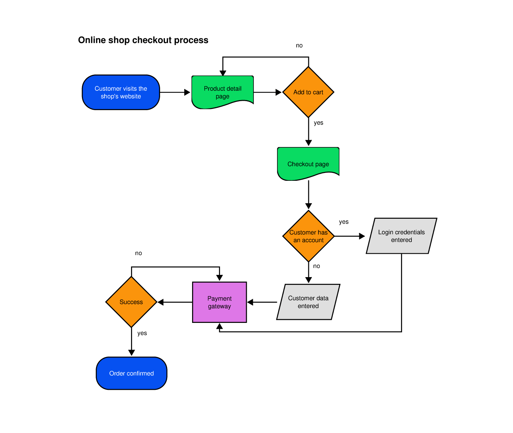
    - Touch points:
        - **Products page**
        - **Products detail** page/Add to cart/bag
        - Go to secure checkout - brings you **shopping bag (summary) page**
        - Click secure checkout - brings to **checkout form**
        - **Log in** (if not already), or simply continute to payment field
        - Enter card detail into field - send to Stripe 
        - Adjust bag, or complete order
        - Get success, with order summary or failure message
        - Get confirmation email.
    - Emotions: 
        - Happy if the process is fast, smooth and takes little time to complete.
        - Happy if the user doesn't not have to sign in, and receives plenty of confirmation along the way so they are confident the site works and will be secure.
        - Happy if they can call upon shipping details already entered in the past and purchase quicker. 
        - Angry if faced with a lot of error messages, forms that are unclear, a payment field that is not clear about what cards it accepts.
    - Pain points;
        - Form is so restrictive that it is hard to get through it without a lot of errors.
        - Checkout doesn't support all card types.
    - Solutions:
        - Clarify with symbols which cards are accepted.
- Onboarding:
    - User Action: Customer receives item.
    - Pain Points: 
        - Item not delivered quickly.
        - Item damaged.
    - Solutions:
        - Provide clear shipping and returns policies/information. 
        - Provide clear returns policy
        - Make footer sticky so returns and shipping policy always visiable.
        - Provide contact page to make it easy for customer to report problems.
- Advocacy: 
    - User Action
        - Gives a great review on site or facebook page.
        - Gives a poor review if checkout experience is bad.
        - Gives a poor review if customer service is poor following delivery problems, or unanswered questions. 
        - Recommends tutorials and exhibitions to friends interested in art.
    - Touchpoints:
    - Customer reviews page.
    - Painpoints as mentioned above in user actions section.
    - Solutions:
        - Include shipping tracking field in custom model and trigger an email when product is marked as fulfilled.
        - Give incentives for customers to give reviews to better understand customer journey and make improvements to the website. 
        - Include links in the confirmation email to encourage to come to exhibitions or follow the tutorials.
        - Make it easy to share products
        - Post tutorials frequently and keep events page for as long as it is regularly updated. Giving customers a reason to keep returning to the site for interesting activities and learning should create advocates for the website and company.

## The Skeleton Plane

### Large Screen Wireframes

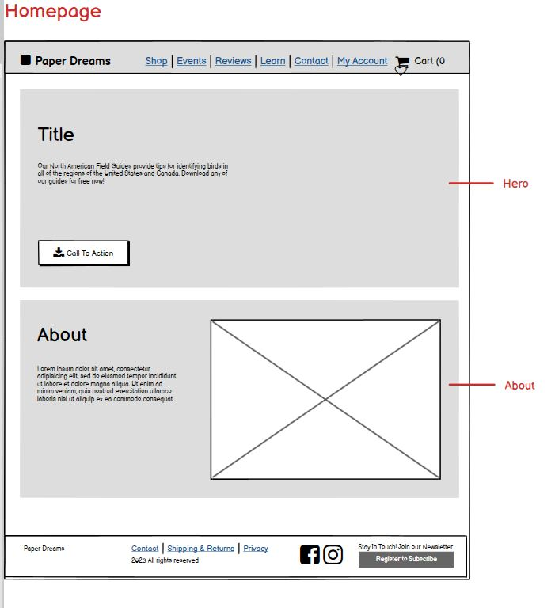
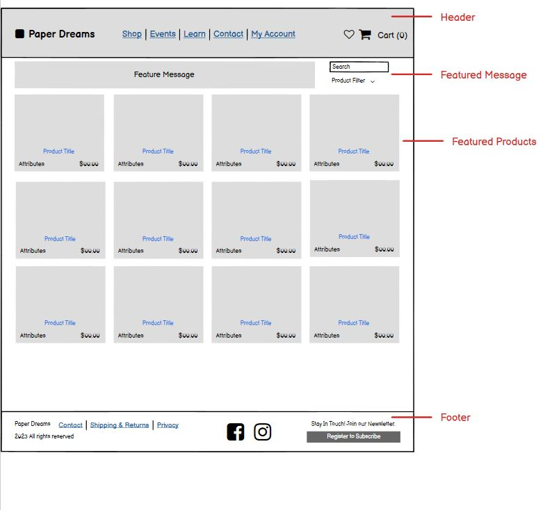

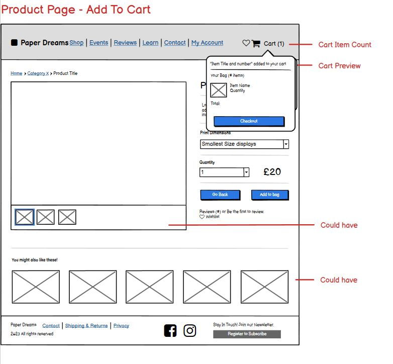
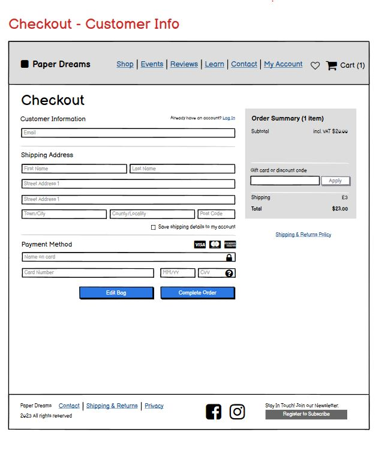
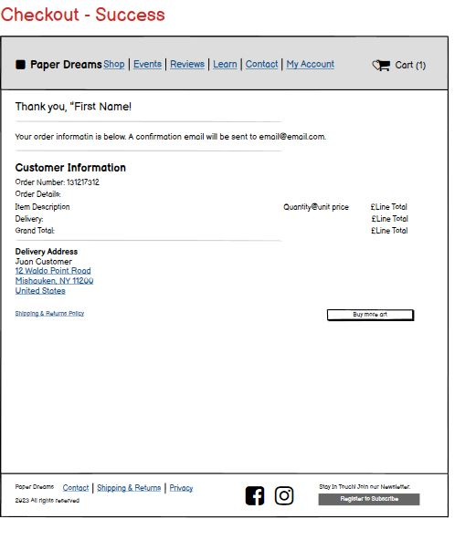
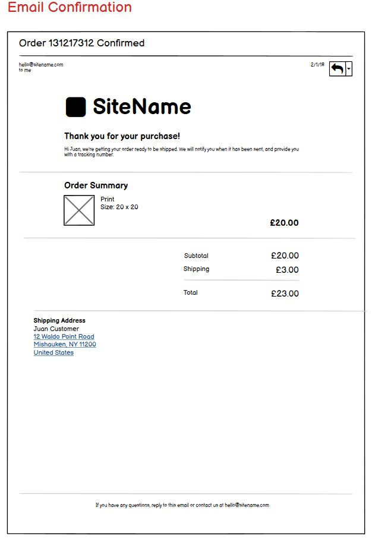
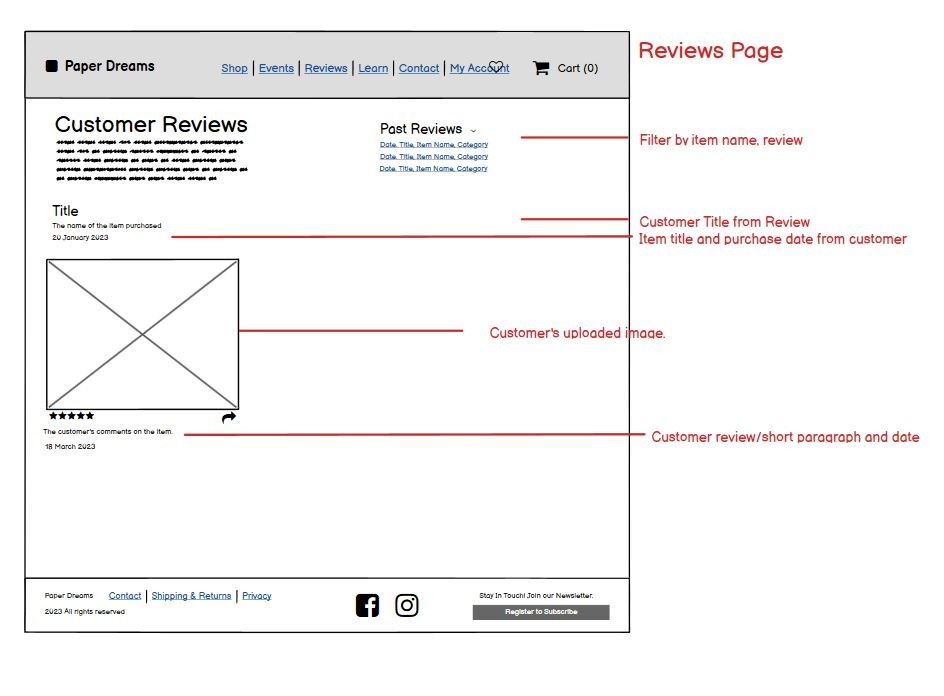
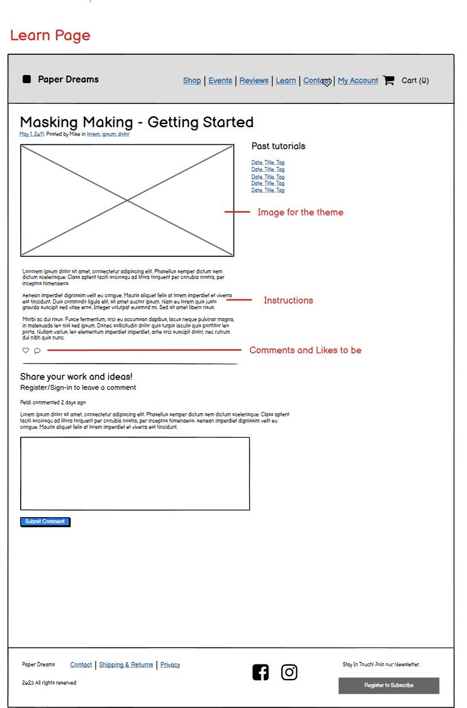`
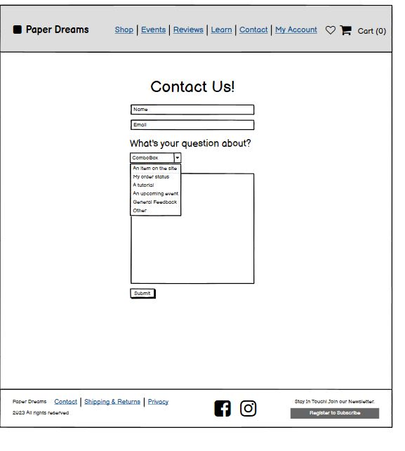
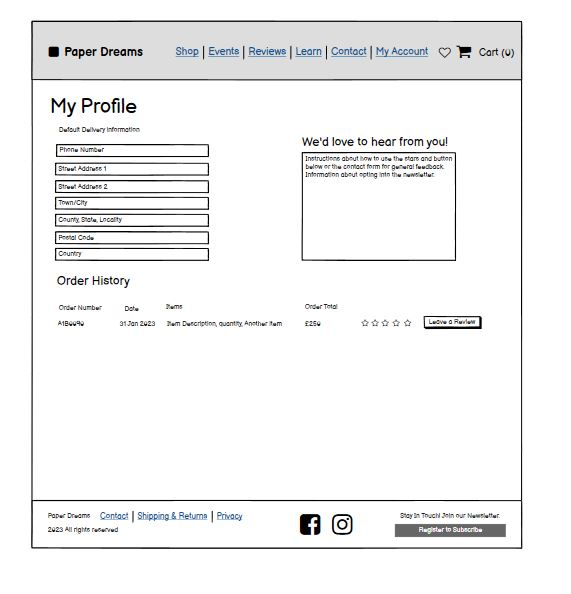

## The Surface Plane

### Branding
#### Fonts
As many of the items on the site are fun and aim to add a bit of spice and fun into people's environment, the site user wanted a font that reflected this. The site name/logo will uses Henny Penny, 
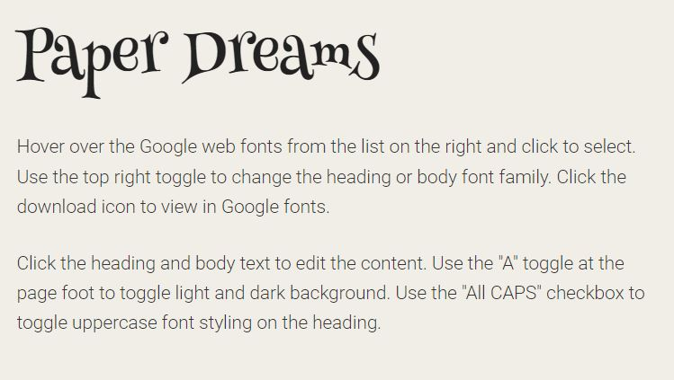

#### Colour palette
### Interaction
### Accessibility

## Technologies and resources

Planning and resources
- [Markdown Cheat Sheet](https://www.markdownguide.org/cheat-sheet/)
- Lucid Charts
- Balsamiq Wireframes

Fonts and Icons
- [Google Fonts](https://fonts.google.com/)
- [Font Pairing, by Our Own Thing](http://www.ourownthing.co.uk/fontpairing/)
- Favicon.io
- Font Awesome

Images
- Cloud convert

Version Control and editor
- GitHub
- GitPod

Languages
- HTML
- CSS
- Bootstrap
- Javascript
- Python
- Django
    - Crispy Forms
    - Pillow

SEO/Site maps
- [Online sitemap generator](https://www.xml-sitemaps.com/)
- [Wordtracker](https://www.wordtracker.com/) - USER FREE TRIAL!

Deployment resources
- Heroku
- ElephantSQL

Language Validators and format helpers
- W3C Markup Validation Service
- W3C CSS Validation Service
- JSHint
- CI Python Linter
- autopep8
